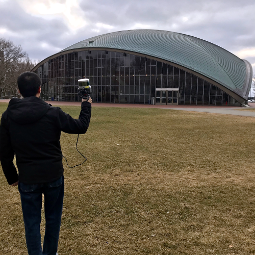
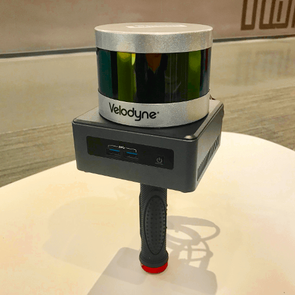
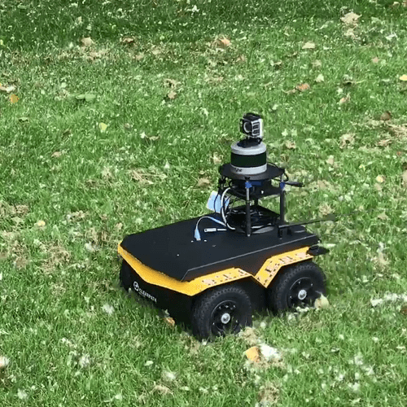
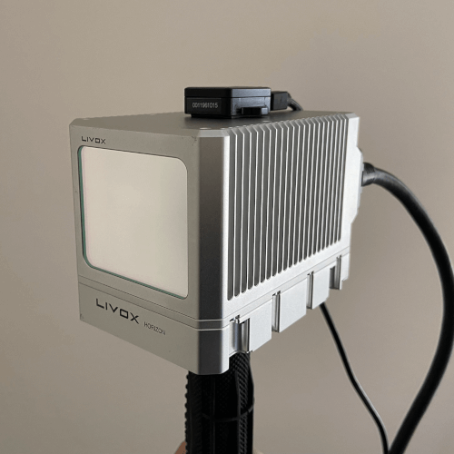
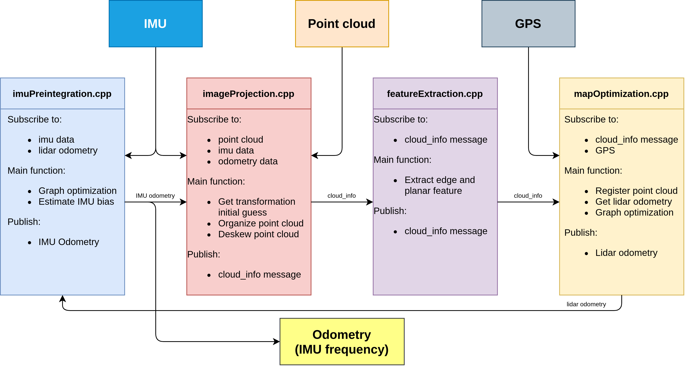
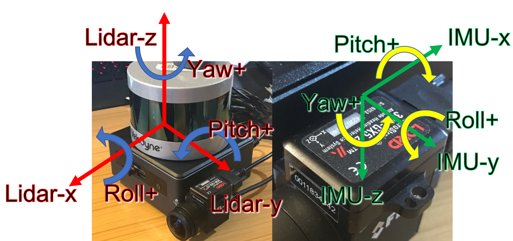
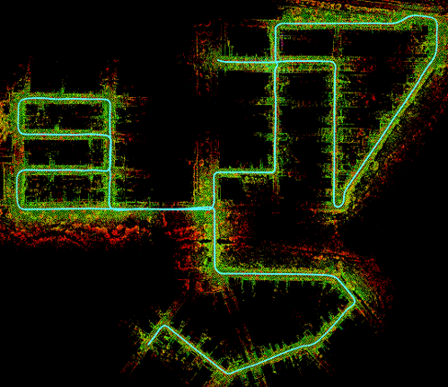
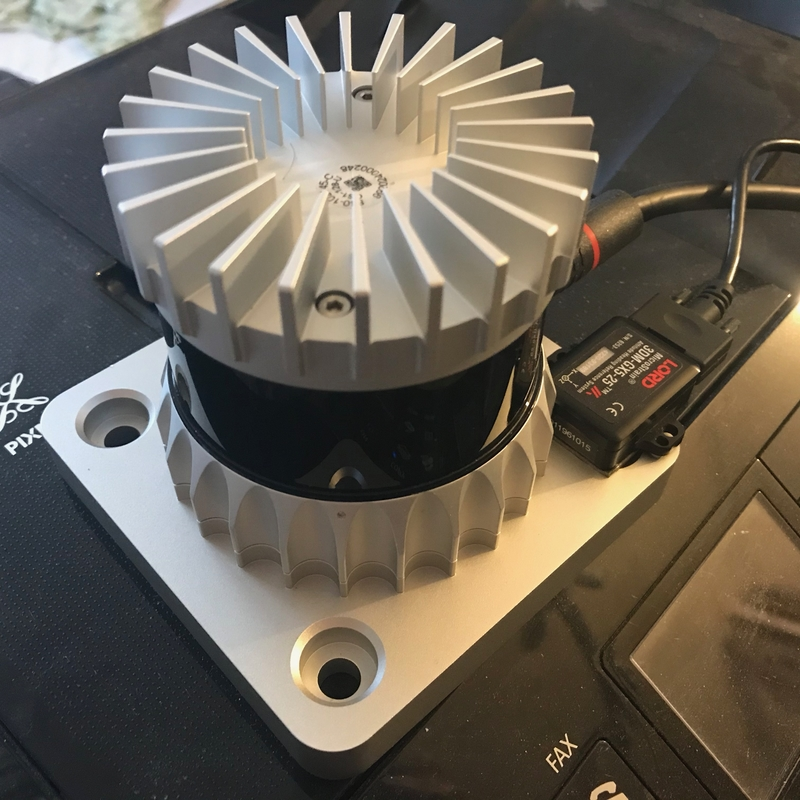

# LIO-SAM

**A real-time lidar-inertial odometry package. We strongly recommend the users read this document thoroughly and test the package with the provided dataset first. A video of the demonstration of the method can be found on [YouTube](https://www.youtube.com/watch?v=A0H8CoORZJU).**

<p align='center'>
    
</p>

<p align='center'>
    
    
    
    
</p>

## Menu

  - [**System architecture**](#system-architecture)

  - [**Package dependency**](#dependency)

  - [**Package install**](#install)

  - [**Prepare lidar data**](#prepare-lidar-data) (must read)

  - [**Prepare IMU data**](#prepare-imu-data) (must read)

  - [**Sample datasets**](#sample-datasets)

  - [**Run the package**](#run-the-package)

  - [**Other notes**](#other-notes)

  - [**Issues**](#issues)

  - [**Paper**](#paper)

  - [**TODO**](#todo)

  - [**Related Package**](#related-package)

  - [**Acknowledgement**](#acknowledgement)

## System architecture

<p align='center'>
    
</p>

We design a system that maintains two graphs and runs up to 10x faster than real-time.
  - The factor graph in "mapOptimization.cpp" optimizes lidar odometry factor and GPS factor. This factor graph is maintained consistently throughout the whole test.
  - The factor graph in "imuPreintegration.cpp" optimizes IMU and lidar odometry factor and estimates IMU bias. This factor graph is reset periodically and guarantees real-time odometry estimation at IMU frequency.

## Dependency

This is the original ROS1 implementation of LIO-SAM. For a ROS2 implementation see branch `ros2`.

- [ROS](http://wiki.ros.org/ROS/Installation) (tested with Kinetic and Melodic. Refer to [#206](https://github.com/TixiaoShan/LIO-SAM/issues/206) for Noetic)
  ```
  sudo apt-get install -y ros-kinetic-navigation
  sudo apt-get install -y ros-kinetic-robot-localization
  sudo apt-get install -y ros-kinetic-robot-state-publisher
  ```
- [gtsam](https://gtsam.org/get_started/) (Georgia Tech Smoothing and Mapping library)
  ```
  sudo add-apt-repository ppa:borglab/gtsam-release-4.0
  sudo apt install libgtsam-dev libgtsam-unstable-dev
  ```

## Install

Use the following commands to download and compile the package.

```
cd ~/catkin_ws/src
git clone https://github.com/TixiaoShan/LIO-SAM.git
cd ..
catkin_make
```

## Using Docker
Build image (based on ROS1 Kinetic):

```bash
docker build -t liosam-kinetic-xenial .
```

Once you have the image, start a container as follows:

```bash
docker run --init -it -d \
  -v /etc/localtime:/etc/localtime:ro \
  -v /etc/timezone:/etc/timezone:ro \
  -v /tmp/.X11-unix:/tmp/.X11-unix \
  -e DISPLAY=$DISPLAY \
  liosam-kinetic-xenial \
  bash
```


## Prepare lidar data

The user needs to prepare the point cloud data in the correct format for cloud deskewing, which is mainly done in "imageProjection.cpp". The two requirements are:
  - **Provide point time stamp**. LIO-SAM uses IMU data to perform point cloud deskew. Thus, the relative point time in a scan needs to be known. The up-to-date Velodyne ROS driver should output this information directly. Here, we assume the point time channel is called "time." The definition of the point type is located at the top of the "imageProjection.cpp." "deskewPoint()" function utilizes this relative time to obtain the transformation of this point relative to the beginning of the scan. When the lidar rotates at 10Hz, the timestamp of a point should vary between 0 and 0.1 seconds. If you are using other lidar sensors, you may need to change the name of this time channel and make sure that it is the relative time in a scan.
  - **Provide point ring number**. LIO-SAM uses this information to organize the point correctly in a matrix. The ring number indicates which channel of the sensor that this point belongs to. The definition of the point type is located at the top of "imageProjection.cpp." The up-to-date Velodyne ROS driver should output this information directly. Again, if you are using other lidar sensors, you may need to rename this information. Note that only mechanical lidars are supported by the package currently.

## Prepare IMU data

  - **IMU requirement**. Like the original LOAM implementation, LIO-SAM only works with a 9-axis IMU, which gives roll, pitch, and yaw estimation. The roll and pitch estimation is mainly used to initialize the system at the correct attitude. The yaw estimation initializes the system at the right heading when using GPS data. Theoretically, an initialization procedure like VINS-Mono will enable LIO-SAM to work with a 6-axis IMU. The performance of the system largely depends on the quality of the IMU measurements. The higher the IMU data rate, the better the system accuracy. We use Microstrain 3DM-GX5-25, which outputs data at 500Hz. We recommend using an IMU that gives at least a 200Hz output rate. Note that the internal IMU of Ouster lidar is an 6-axis IMU.

  - **IMU alignment**. LIO-SAM transforms IMU raw data from the IMU frame to the Lidar frame, which follows the ROS REP-105 convention (x - forward, y - left, z - upward). To make the system function properly, the correct extrinsic transformation needs to be provided in "params.yaml" file. **The reason why there are two extrinsics is that my IMU (Microstrain 3DM-GX5-25) acceleration and attitude have different cooridinates. Depend on your IMU manufacturer, the two extrinsics for your IMU may or may not be the same**. Using our setup as an example:
    - we need to set the readings of x-z acceleration and gyro negative to transform the IMU data in the lidar frame, which is indicated by "extrinsicRot" in "params.yaml."
    - The transformation of attitude readings might be slightly different. IMU's attitude measurement `q_wb` usually means the rotation of points in the IMU coordinate system to the world coordinate system (e.g. ENU). However, the algorithm requires `q_wl`, the rotation from lidar to world. So we need a rotation from lidar to IMU `q_bl`, where `q_wl = q_wb * q_bl`. For convenience, the user only needs to provide `q_lb` as "extrinsicRPY" in "params.yaml" (same as the "extrinsicRot" if acceleration and attitude have the same coordinate).

  - **IMU debug**. It's strongly recommended that the user uncomment the debug lines in "imuHandler()" of "imageProjection.cpp" and test the output of the transformed IMU data. The user can rotate the sensor suite to check whether the readings correspond to the sensor's movement. A YouTube video that shows the corrected IMU data can be found [here (link to YouTube)](https://youtu.be/BOUK8LYQhHs).


<p align='center'>
    
</p>
<p align='center'>
    
</p>

## Sample datasets

  * Download some sample datasets to test the functionality of the package. The datasets below are configured to run using the default settings:
    - **Walking dataset:** [[Google Drive](https://drive.google.com/drive/folders/1gJHwfdHCRdjP7vuT556pv8atqrCJPbUq?usp=sharing)]
    - **Park dataset:** [[Google Drive](https://drive.google.com/drive/folders/1gJHwfdHCRdjP7vuT556pv8atqrCJPbUq?usp=sharing)]
    - **Garden dataset:** [[Google Drive](https://drive.google.com/drive/folders/1gJHwfdHCRdjP7vuT556pv8atqrCJPbUq?usp=sharing)]

  * The datasets below need the parameters to be configured. In these datasets, the point cloud topic is "points_raw." The IMU topic is "imu_correct," which gives the IMU data in ROS REP105 standard. Because no IMU transformation is needed for this dataset, the following configurations need to be changed to run this dataset successfully:
    - The "imuTopic" parameter in "config/params.yaml" needs to be set to "imu_correct".
    - The "extrinsicRot" and "extrinsicRPY" in "config/params.yaml" needs to be set as identity matrices.
      - **Rotation dataset:** [[Google Drive](https://drive.google.com/drive/folders/1gJHwfdHCRdjP7vuT556pv8atqrCJPbUq?usp=sharing)]
      - **Campus dataset (large):** [[Google Drive](https://drive.google.com/drive/folders/1gJHwfdHCRdjP7vuT556pv8atqrCJPbUq?usp=sharing)]
      - **Campus dataset (small):** [[Google Drive](https://drive.google.com/drive/folders/1gJHwfdHCRdjP7vuT556pv8atqrCJPbUq?usp=sharing)]

  * Ouster (OS1-128) dataset. No extrinsics need to be changed for this dataset if you are using the default settings. Please follow the Ouster notes below to configure the package to run with Ouster data. A video of the dataset can be found on [YouTube](https://youtu.be/O7fKgZQzkEo):
    - **Rooftop dataset:** [[Google Drive](https://drive.google.com/drive/folders/1gJHwfdHCRdjP7vuT556pv8atqrCJPbUq?usp=sharing)]

  * Livox Horizon dataset. Please refer to the following notes section for paramater changes.
    - **Livox Horizon:** [[Google Drive](https://drive.google.com/drive/folders/1gJHwfdHCRdjP7vuT556pv8atqrCJPbUq?usp=sharing)]

  * KITTI dataset. The extrinsics can be found in the Notes KITTI section below. To generate more bags using other KITTI raw data, you can use the python script provided in "config/doc/kitti2bag".
    - **2011_09_30_drive_0028:** [[Google Drive](https://drive.google.com/drive/folders/1gJHwfdHCRdjP7vuT556pv8atqrCJPbUq?usp=sharing)]

## Run the package

1. Run the launch file:
```
roslaunch lio_sam run.launch
```

2. Play existing bag files:
```
rosbag play your-bag.bag -r 3
```

## Other notes

  - **Loop closure:** The loop function here gives an example of proof of concept. It is directly adapted from LeGO-LOAM loop closure. For more advanced loop closure implementation, please refer to [ScanContext](https://github.com/irapkaist/SC-LeGO-LOAM). Set the "loopClosureEnableFlag" in "params.yaml" to "true" to test the loop closure function. In Rviz, uncheck "Map (cloud)" and check "Map (global)". This is because the visualized map - "Map (cloud)" - is simply a stack of point clouds in Rviz. Their postion will not be updated after pose correction. The loop closure function here is simply adapted from LeGO-LOAM, which is an ICP-based method. Because ICP runs pretty slow, it is suggested that the playback speed is set to be "-r 1". You can try the Garden dataset for testing.

<p align='center'>
    
    
</p>

  - **Using GPS:** The park dataset is provided for testing LIO-SAM with GPS data. This dataset is gathered by [Yewei Huang](https://robustfieldautonomylab.github.io/people.html). To enable the GPS function, change "gpsTopic" in "params.yaml" to "odometry/gps". In Rviz, uncheck "Map (cloud)" and check "Map (global)". Also check "Odom GPS", which visualizes the GPS odometry. "gpsCovThreshold" can be adjusted to filter bad GPS readings. "poseCovThreshold" can be used to adjust the frequency of adding GPS factor to the graph. For example, you will notice the trajectory is constantly corrected by GPS whey you set "poseCovThreshold" to 1.0. Because of the heavy iSAM optimization, it's recommended that the playback speed is "-r 1".

<p align='center'>
    
</p>

  - **KITTI:** Since LIO-SAM needs a high-frequency IMU for function properly, we need to use KITTI raw data for testing. One problem remains unsolved is that the intrinsics of the IMU are unknown, which has a big impact on the accuracy of LIO-SAM. Download the provided sample data and make the following changes in "params.yaml":
    - extrinsicTrans: [-8.086759e-01, 3.195559e-01, -7.997231e-01]
    - extrinsicRot: [9.999976e-01, 7.553071e-04, -2.035826e-03, -7.854027e-04, 9.998898e-01, -1.482298e-02, 2.024406e-03, 1.482454e-02, 9.998881e-01]
    - extrinsicRPY: [9.999976e-01, 7.553071e-04, -2.035826e-03, -7.854027e-04, 9.998898e-01, -1.482298e-02, 2.024406e-03, 1.482454e-02, 9.998881e-01]
    - N_SCAN: 64
    - downsampleRate: 2 or 4
    - loopClosureEnableFlag: true or false

<p align='center'>
    
    
</p>

  - **Ouster lidar:** To make LIO-SAM work with Ouster lidar, some preparations need to be done on hardware and software level.
    - Hardware:
      - Use an external IMU. LIO-SAM does not work with the internal 6-axis IMU of Ouster lidar. You need to attach a 9-axis IMU to the lidar and perform data-gathering.
      - Configure the driver. Change "timestamp_mode" in your Ouster launch file to "TIME_FROM_PTP_1588" so you can have ROS format timestamp for the point clouds.
    - Config:
      - Change "sensor" in "params.yaml" to "ouster".
      - Change "N_SCAN" and "Horizon_SCAN" in "params.yaml" according to your lidar, i.e., N_SCAN=128, Horizon_SCAN=1024.
    - Gen 1 and Gen 2 Ouster:
      It seems that the point coordinate definition might be different in different generations. Please refer to [Issue #94](https://github.com/TixiaoShan/LIO-SAM/issues/94) for debugging.

<p align='center'>
    
    
</p>

  - **Livox Horizon lidar:** Please note that solid-state lidar hasn't been extensively tested with LIO-SAM yet. An external IMU is also used here rather than the internal one. The support for such lidars is based on minimal change of the codebase from mechanical lidars. A customized [livox_ros_driver](https://github.com/TixiaoShan/livox_ros_driver) needs to be used to publish point cloud format that can be processed by LIO-SAM. Other SLAM solutions may offer better implementations. More studies and suggestions are welcome. Please change the following parameters to make LIO-SAM work with Livox Horizon lidar:
    - sensor: livox
    - N_SCAN: 6
    - Horizon_SCAN: 4000
    - edgeFeatureMinValidNum: 1
    - Use [livox_ros_driver](https://github.com/TixiaoShan/livox_ros_driver) for data recording

<p align='center'>
    
</p>

## Service
  - /lio_sam/save_map
    - save map as a PCD file.
      ``` bash
        rosservice call [service] [resolution] [destination]
      ```
      - Example:
      ``` bash
        $ rosservice call /lio_sam/save_map 0.2 "/Downloads/LOAM/"
      ```

## Issues

  - **Zigzag or jerking behavior**: if your lidar and IMU data formats are consistent with the requirement of LIO-SAM, this problem is likely caused by un-synced timestamp of lidar and IMU data.

  - **Jumpping up and down**: if you start testing your bag file and the base_link starts to jump up and down immediately, it is likely your IMU extrinsics are wrong. For example, the gravity acceleration has negative value.

  - **mapOptimization crash**: it is usually caused by GTSAM. Please install the GTSAM specified in the README.md. More similar issues can be found [here](https://github.com/TixiaoShan/LIO-SAM/issues).

  - **gps odometry unavailable**: it is generally caused due to unavailable transform between message frame_ids and robot frame_id (for example: transform should be available from "imu_frame_id" and "gps_frame_id" to "base_link" frame. Please read the Robot Localization documentation found [here](http://docs.ros.org/en/melodic/api/robot_localization/html/preparing_sensor_data.html).

## Paper

Thank you for citing [LIO-SAM (IROS-2020)](./config/doc/paper.pdf) if you use any of this code.
```
@inproceedings{liosam2020shan,
  title={LIO-SAM: Tightly-coupled Lidar Inertial Odometry via Smoothing and Mapping},
  author={Shan, Tixiao and Englot, Brendan and Meyers, Drew and Wang, Wei and Ratti, Carlo and Rus Daniela},
  booktitle={IEEE/RSJ International Conference on Intelligent Robots and Systems (IROS)},
  pages={5135-5142},
  year={2020},
  organization={IEEE}
}
```

Part of the code is adapted from [LeGO-LOAM](https://github.com/RobustFieldAutonomyLab/LeGO-LOAM).
```
@inproceedings{legoloam2018shan,
  title={LeGO-LOAM: Lightweight and Ground-Optimized Lidar Odometry and Mapping on Variable Terrain},
  author={Shan, Tixiao and Englot, Brendan},
  booktitle={IEEE/RSJ International Conference on Intelligent Robots and Systems (IROS)},
  pages={4758-4765},
  year={2018},
  organization={IEEE}
}
```

## TODO

  - [ ] [Bug within imuPreintegration](https://github.com/TixiaoShan/LIO-SAM/issues/104)

## Related Package

  - [Lidar-IMU calibration](https://github.com/chennuo0125-HIT/lidar_imu_calib)
  - [LIO-SAM with Scan Context](https://github.com/gisbi-kim/SC-LIO-SAM)

## Acknowledgement

  - LIO-SAM is based on LOAM (J. Zhang and S. Singh. LOAM: Lidar Odometry and Mapping in Real-time).
