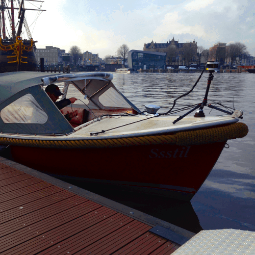

# LIO-SAM

**A real-time lidar-inertial odometry package. We strongly recommend the users read this document thoroughly and test the package with the provided dataset first. A video of the demonstration of the method can be found on [YouTube](https://www.youtube.com/watch?v=A0H8CoORZJU).**

<p align='center'>
    
</p>

<p align='center'>
    
    
    
    
</p>

## Menu

  - [**System architecture**](#system-architecture)

  - [**Package dependency**](#dependency)

  - [**Package install**](#install)

  - [**Prepare lidar data**](#prepare-lidar-data) (must read)

  - [**Prepare IMU data**](#prepare-imu-data) (must read)

  - [**Sample datasets**](#sample-datasets)

  - [**Run the package**](#run-the-package)

  - [**Other notes**](#other-notes)

  - [**Paper**](#paper)

  - [**TODO**](#todo)

  - [**Acknowledgement**](#acknowledgement)

## System architecture

<p align='center'>
    
</p>

We design a system that maintains two graphs and runs up to 10x faster than real-time. 
  - The factor graph in "mapOptimization.cpp" optimizes lidar odometry factor and GPS factor. This factor graph is maintained consistently throughout the whole test. 
  - The factor graph in "imuPreintegration.cpp" optimizes IMU and lidar odometry factor and estimates IMU bias. This factor graph is reset periodically and guarantees real-time odometry estimation at IMU frequency.

## Dependency

- [ROS](http://wiki.ros.org/ROS/Installation) (tested with Kinetic and Melodic)
  ```
  sudo apt-get install -y ros-kinetic-navigation
  sudo apt-get install -y ros-kinetic-robot-localization
  sudo apt-get install -y ros-kinetic-robot-state-publisher
  ```
- [gtsam](https://github.com/borglab/gtsam/releases) (Georgia Tech Smoothing and Mapping library)
  ```
  wget -O ~/Downloads/gtsam.zip https://github.com/borglab/gtsam/archive/4.0.2.zip
  cd ~/Downloads/ && unzip gtsam.zip -d ~/Downloads/
  cd ~/Downloads/gtsam-4.0.2/
  mkdir build && cd build
  cmake -DGTSAM_BUILD_WITH_MARCH_NATIVE=OFF ..
  sudo make install -j8
  ```

## Install

Use the following commands to download and compile the package.

```
cd ~/catkin_ws/src
git clone https://github.com/TixiaoShan/LIO-SAM.git
cd ..
catkin_make
```

## Prepare lidar data

The user needs to prepare the point cloud data in the correct format for cloud deskewing, which is mainly done in "imageProjection.cpp". The two requirements are:
  - **Provide point time stamp**. LIO-SAM uses IMU data to perform point cloud deskew. Thus, the relative point time in a scan needs to be known. The up-to-date Velodyne ROS driver should output this information directly. Here, we assume the point time channel is called "time." The definition of the point type is located at the top of the "imageProjection.cpp." "deskewPoint()" function utilizes this relative time to obtain the transformation of this point relative to the beginning of the scan. When the lidar rotates at 10Hz, the timestamp of a point should vary between 0 and 0.1 seconds. If you are using other lidar sensors, you may need to change the name of this time channel and make sure that it is the relative time in a scan.
  - **Provide point ring number**. LIO-SAM uses this information to organize the point correctly in a matrix. The ring number indicates which channel of the sensor that this point belongs to. The definition of the point type is located at the top of "imageProjection.cpp." The up-to-date Velodyne ROS driver should output this information directly. Again, if you are using other lidar sensors, you may need to rename this information. Note that only mechanical lidars are supported by the package currently. 

## Prepare IMU data

  - **IMU requirement**. Like the original LOAM implementation, LIO-SAM only works with a 9-axis IMU, which gives roll, pitch, and yaw estimation. The roll and pitch estimation is mainly used to initialize the system at the correct attitude. The yaw estimation initializes the system at the right heading when using GPS data. Theoretically, an initialization procedure like VINS-Mono will enable LIO-SAM to work with a 6-axis IMU. The performance of the system largely depends on the quality of the IMU measurements. The higher the IMU data rate, the better the system accuracy. We use Microstrain 3DM-GX5-25, which outputs data at 500Hz. We recommend using an IMU that gives at least a 200Hz output rate. Note that the internal IMU of Ouster lidar is not usable due to high vibration.

  - **IMU alignment**. LIO-SAM transforms IMU raw data from the IMU frame to the Lidar frame, which follows the ROS REP-105 convention (x - forward, y - left, z - upward). To make the system function properly, the correct extrinsic transformation needs to be provided in "params.yaml" file. Using our setup as an example:
    - we need to set the readings of x-z acceleration and gyro negative to transform the IMU data in the lidar frame, which is indicated by "extrinsicRot" in "params.yaml." 
    - The transformation of attitude readings is slightly different. We rotate the attitude measurements by -90 degrees around "lidar-z" axis and get the corresponding roll, pitch, and yaw readings in the lidar frame. This transformation is indicated by "extrinsicRPY" in "params.yaml."

  - **IMU debug**. It's strongly recommended that the user uncomment the debug lines in "imuHandler()" of "imageProjection.cpp" and test the output of the transformed IMU data. The user can rotate the sensor suite to check whether the readings correspond to the sensor's movement.

<p align='center'>
    
</p>

## Sample datasets

  * Download some sample datasets to test the functionality of the package. The datasets below is configured to run using the default settings:
    - [**Walking dataset**](https://drive.google.com/file/d/1HN5fYPXEHbDq0E5JtbQPkCHIHUoTFFnN/view?usp=sharing)
    - [**Garden dataset**](https://drive.google.com/file/d/1q6yuVhyJbkUBhut9yhfox2WdV4VZ9BZX/view?usp=sharing)
    - [**Park dataset**](https://drive.google.com/file/d/19PZieaJaVkXDs2ZromaHTxYoq0zkiHae/view?usp=sharing)

  * The datasets below need the parameters to be configured. In these datasets, the point cloud topic is "points_raw." The IMU topic is "imu_correct," which gives the IMU data in ROS REP105 standard. Because no IMU transformation is needed for this dataset, the following configurations need to be changed to run this dataset successfully:
    - The "imuTopic" parameter in "config/params.yaml" needs to be set to "imu_correct".
    - The "extrinsicRot" and "extrinsicRPY" in "config/params.yaml" needs to be set as identity matrices.
      - [**Rotation dataset**](https://drive.google.com/file/d/1V4ijY4PgLdjKmdzcQ18Xu7VdcHo2UaWI/view?usp=sharing)
      - [**Campus dataset (large)**](https://drive.google.com/file/d/1q4Sf7s2veVc7bs08Qeha3stOiwsytopL/view?usp=sharing)
      - [**Campus dataset (small)**](https://drive.google.com/file/d/1_V-cFMTQ4RO-_16mU9YPUE8ozsPeddCv/view?usp=sharing)

  * Ouster (OS1-128) dataset. No extrinsics need to be changed for this dataset if you are using the default settings. Please follow the Ouster notes below to configure the package to run with Ouster data. A video of the dataset can be found on [YouTube](https://youtu.be/O7fKgZQzkEo):
    - [**Rooftop dataset**](https://drive.google.com/file/d/1Qy2rZdPudFhDbATPpblioBb8fRtjDGQj/view?usp=sharing)

  * KITTI dataset. The extrinsics can be found in the Notes KITTI section below. To generate more bags using other KITTI raw data, you can use the python script provided in "config/doc/kitti2bag".
    - [**2011_09_30_drive_0028**](https://drive.google.com/file/d/12h3ooRAZVTjoMrf3uv1_KriEXm33kHc7/view?usp=sharing)

## Run the package

1. Run the launch file:
```
roslaunch lio_sam run.launch
```

2. Play existing bag files:
```
rosbag play your-bag.bag -r 3
```

## Other notes

  - **Loop closure:** The loop function here gives an example of proof of concept. It is directly adapted from LeGO-LOAM loop closure. For more advanced loop closure implementation, please refer to [ScanContext](https://github.com/irapkaist/SC-LeGO-LOAM). Set the "loopClosureEnableFlag" in "params.yaml" to "true" to test the loop closure function. In Rviz, uncheck "Map (cloud)" and check "Map (global)". This is because the visualized map - "Map (cloud)" - is simply a stack of point clouds in Rviz. Their postion will not be updated after pose correction. The loop closure function here is simply adapted from LeGO-LOAM, which is an ICP-based method. Because ICP runs pretty slow, it is suggested that the playback speed is set to be "-r 1". You can try the Campus dataset (large) for testing. The loop closure happens when the sensor returns back to the original starting location.

<p align='center'>
    
</p>

  - **Using GPS:** The park dataset is provided for testing LIO-SAM with GPS data. This dataset is gathered by [Yewei Huang](https://robustfieldautonomylab.github.io/people.html). To enable the GPS function, change "gpsTopic" in "params.yaml" to "odometry/gps". In Rviz, uncheck "Map (cloud)" and check "Map (global)". Also check "Odom GPS", which visualizes the GPS odometry. "gpsCovThreshold" can be adjusted to filter bad GPS readings. "poseCovThreshold" can be used to adjust the frequency of adding GPS factor to the graph. For example, you will notice the trajectory is constantly corrected by GPS whey you set "poseCovThreshold" to 1.0. Because of the heavy iSAM optimization, it's recommended that the playback speed is "-r 1".

<p align='center'>
    
</p>

  - **KITTI:** Since LIO-SAM needs a high-frequency IMU for function properly, we need to use KITTI raw data for testing. One problem remains unsolved is that the intrinsics of the IMU are unknown, which has a big impact on the accuracy of LIO-SAM. Download the provided sample data and make the following changes in "params.yaml":
    - extrinsicTrans: [-8.086759e-01, 3.195559e-01, -7.997231e-01] 
    - extrinsicRot: [9.999976e-01, 7.553071e-04, -2.035826e-03, -7.854027e-04, 9.998898e-01, -1.482298e-02, 2.024406e-03, 1.482454e-02, 9.998881e-01]
    - extrinsicRPY: [9.999976e-01, 7.553071e-04, -2.035826e-03, -7.854027e-04, 9.998898e-01, -1.482298e-02, 2.024406e-03, 1.482454e-02, 9.998881e-01]
    - N_SCAN: 64
    - downsampleRate: 2 or 4
    - loopClosureEnableFlag: true or false

<p align='center'>
    
    
</p>

  - **Ouster lidar:** To make LIO-SAM work with Ouster lidar, some preparations needs to be done on hardware and software level.
    - Hardware:
      - Use an external IMU. LIO-SAM does not work with the internal 6-axis IMU of Ouster lidar. You need to attach a 9-axis IMU to the lidar and perform data-gathering.
      - Configure the driver. Change "timestamp_mode" in your Ouster launch file to "TIME_FROM_PTP_1588" so you can have ROS format timestamp for the point clouds.
    - Software:
      - Change "timeField" in "params.yaml" to "t". "t" is the point timestamp in a scan for Ouster lidar.
      - Change "N_SCAN" and "Horizon_SCAN" in "params.yaml" according to your lidar, i.e., N_SCAN=128, Horizon_SCAN=1024.
      - Comment the point definition for Velodyne on top of "imageProjection.cpp".
      - Uncomment the point definition for Ouster on top of "imageProjection.cpp".
      - Comment line "deskewPoint(&thisPoint, laserCloudIn->points[i].time)" in "imageProjection.cpp".
      - Uncomment line "deskewPoint(&thisPoint, (float)laserCloudIn->points[i].t / 1000000000.0" in "imageProjection.cpp".
      - Run "catkin_make" to re-compile the package.

<p align='center'>
    
    
</p>

## Paper 

Thank you for citing [LIO-SAM (IROS-2020)](./config/doc/paper.pdf) if you use any of this code. 
```
@inproceedings{liosam2020shan,
  title={LIO-SAM: Tightly-coupled Lidar Inertial Odometry via Smoothing and Mapping},
  author={Shan, Tixiao and Englot, Brendan and Meyers, Drew and Wang, Wei and Ratti, Carlo and Rus Daniela},
  journal={arXiv preprint arXiv:2007.00258}
  year={2020}
}
```

Part of the code is adapted from [LeGO-LOAM](https://github.com/RobustFieldAutonomyLab/LeGO-LOAM).
```
@inproceedings{legoloam2018shan,
  title={LeGO-LOAM: Lightweight and Ground-Optimized Lidar Odometry and Mapping on Variable Terrain},
  author={Shan, Tixiao and Englot, Brendan},
  booktitle={IEEE/RSJ International Conference on Intelligent Robots and Systems (IROS)},
  pages={4758-4765},
  year={2018},
  organization={IEEE}
}
```

## TODO

  - [ ] Add loop closure visualization and fix potential bug

## Acknowledgement

  - LIO-SAM is based on LOAM (J. Zhang and S. Singh. LOAM: Lidar Odometry and Mapping in Real-time).
